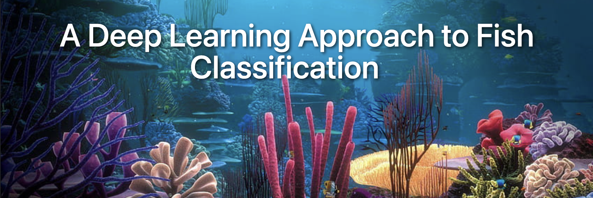
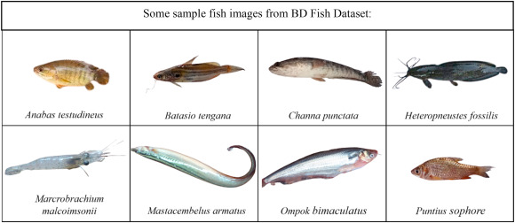

# A Deep Learning Approach to Fish Classification 🐠

## Project Overview
This project focuses on classifying various species of fish using an Artificial Neural Network (ANN) trained on a large-scale fish dataset. The classification of fish species has significant applications in fisheries management, biodiversity assessment, and marine research.

## Project Objectives
- Load and preprocess a comprehensive fish dataset.
- Implement an ANN model for accurate classification of fish species.
- Evaluate model performance using multiple metrics, including ROC curves, F1 score, and recall.
- Visualize results to enhance interpretability and understanding of the model's performance.

## Dataset Information
- **Dataset:** A large-scale fish dataset containing images of various fish species.
- **Classes:**
- The dataset includes the following fish species:
  - Hourse Mackerel
  - Black Sea Sprat
  - Sea Bass
  - Red Mullet
  - Trout
  - Striped Red Mullet
  - Shrimp
  - Gilt-Head Bream
  - Red Sea Bream
- **Total Images:** 9,000 images.
- **Data Split:**
  - **Training Set:** 6,299 images
  - **Validation Set:** 1,351 images
  - **Test Set:** 1,350 images

## Project Steps

### Dataset Preparation
- Loaded the fish dataset and organized it into a structured DataFrame.
- Visualized a selection of samples from different species to understand dataset diversity.

### Data Exploration
- Conducted exploratory data analysis (EDA) to investigate class distributions and identify any imbalances.
- Generated visualizations, including histograms and pie charts, to represent the distribution of fish species.

### Image Processing
- Resized images to a uniform dimension (128x128 pixels) and normalized pixel values to a scale of 0 to 1.
- Split the dataset into training, validation, and test sets to facilitate proper model evaluation.
- 
### Model Building
- Constructed a Sequential ANN model with:
  - Input layer
  - Multiple hidden layers with activation functions (e.g., ReLU)
  - Dropout layers for regularization to combat overfitting
  - Output layer with softmax activation for multi-class classification
- Compiled the model using the Adam optimizer with a learning rate of 0.0001 and categorical cross-entropy loss.

### Model Training
- Trained the model using the training dataset while validating on the validation set.
- Implemented early stopping based on validation loss to avoid overfitting.
- Achieved the following metrics during training:
  - **Training Loss:** 0.2877
  - **Validation Loss:** 0.3683
  - **Training Accuracy:** 90.00%
  - **Validation Accuracy:** 88.16%
- The model demonstrated a successful classification accuracy of approximately 90% on the validation set.

### Evaluation
- Generated a detailed classification report, including precision, recall, and F1 score for each class.
- Created a confusion matrix to visualize model performance across different classes.
- Plotted the ROC curve to illustrate the true positive rate versus the false positive rate for each class, providing insights into model discriminative power.

### Visualization
- Developed visualizations to display:
  - Training and validation accuracy over epochs.
  - Training and validation loss over epochs.
  - Confusion matrix.
  - ROC curve for each class to assess the model's performance comprehensively.

## How ANN Works

Artificial Neural Networks (ANNs) are inspired by biological neural networks and consist of interconnected layers of nodes (neurons). Each neuron processes input data and learns to map inputs to outputs through training. During the training process:
- Each neuron receives input, applies a weight, and passes the result through an activation function.
- The model adjusts the weights based on the error between predicted and actual outputs using backpropagation.
- The learning continues until convergence or early stopping criteria are met.

## Libraries Used
- **pandas:** For data manipulation and analysis.
- **numpy:** For numerical computations.
- **matplotlib, seaborn:** For data visualization.
- **tensorflow, keras:** For building and training the ANN model.
- **sklearn:** For model evaluation metrics and data preprocessing.
- **imblearn:** For handling class imbalance if needed.
- **PIL, cv2:** For image processing tasks.

## Applications
- **Fisheries Management:** Assisting in monitoring fish populations and sustainable fishing practices.
- **Biodiversity Assessment:** Supporting conservation efforts through improved species identification.
- **Aquaculture:** Enhancing species identification for fish farming and breeding programs.

## Model Performance Summary

This document summarizes the performance of the model.

## Training Values
- **Training Loss:** 0.2877
- **Training Accuracy:** 90.00%

## Validation Values
- **Validation Loss:** 0.3683
- **Validation Accuracy:** 88.16%

## Classification Report
- **Precision:** 95%
- **Recall:** 95%
- **F1 Score:** 94%
- **Support:** 1350

- Additional evaluation metrics include F1 score and recall, calculated for each class.
- The ROC curves provide further insights into model performance, with area under the curve (AUC) values indicating the discriminative power for each class.

## Future Work
- **Hyperparameter Tuning:** Use techniques like GridSearchCV or RandomizedSearchCV to optimize model parameters for improved accuracy.
- **Data Augmentation:** Implement image augmentation techniques (e.g., rotation, flipping, scaling) to enhance the dataset and improve model generalization.
- **Transfer Learning:** Explore pre-trained models (such as ResNet or VGG) to leverage existing knowledge for better performance in image classification tasks.
  
 

## Conclusion
This project demonstrates the potential of ANNs in the classification of fish species, achieving a validation accuracy of 95%. With further optimization, additional data, and advanced techniques, the model can be improved to enhance accuracy and reliability.

